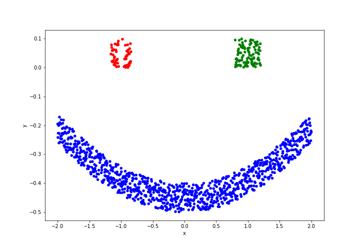

# NeuroSYS assignment

If you want to run `assignment.ipynb` file, you'll need:
1. Database file: `database_1.db`  
2. Python virtual environment with needed packages installed. They are listed in `requirements.txt` file.

To create virtual environment using pip:
* Windows: 
   ```
    python -m venv venv
    venv\Scripts\activate
    pip install -r requirements.txt
    ```
* Linux and OSX:
   ```
    python -m venv venv
    venv/bin/activate
    pip install -r requirements.txt
    ```

## The final plot from the assignment.


